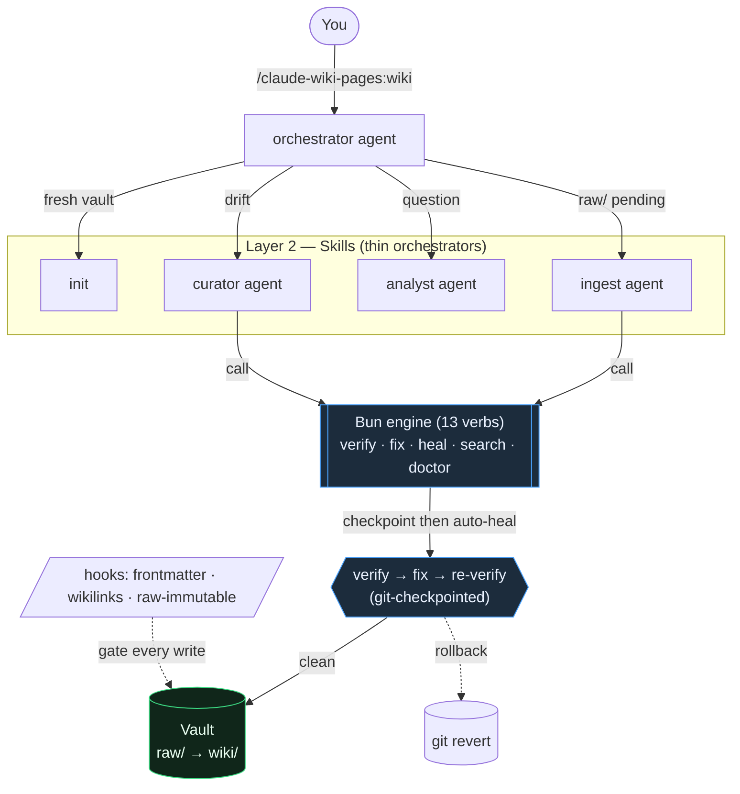

# claude-wiki-pages

> Karpathy's LLM Wiki, shipped as a Claude Code plugin — four layers, hook-enforced.

[](./LICENSE)
[](./CHANGELOG.md)
[](https://docs.claude.com/en/docs/claude-code/plugins)

A Claude Code plugin that turns an **Obsidian vault** into a maintained, provenance-tracked **knowledge base** following [Andrej Karpathy's LLM Wiki pattern](https://gist.github.com/karpathy/442a6bf555914893e9891c11519de94f). The human curates sources; the plugin maintains the wiki; hooks enforce the schema at every tool-call boundary.

The system is convention-driven: the schema lives in [`skills/init/template/CLAUDE.md`](./skills/init/template/CLAUDE.md), the canonical terms in [`docs/GLOSSARY.md`](./docs/GLOSSARY.md), the architecture in [`docs/architecture.md`](./docs/architecture.md). Every skill, agent, and hook binds to them.

---

## What's inside

| Layer        | Surface                                                                                                                                                                                                                                                                                                                                                | Count |
| ------------ | ------------------------------------------------------------------------------------------------------------------------------------------------------------------------------------------------------------------------------------------------------------------------------------------------------------------------------------------------------ | :---: |
| **Data**     | `skills/init/template/` — immutable `raw/`, LLM-maintained `wiki/`, schema in `vault/CLAUDE.md`                                                                                                                                                                                                                                                          |   1   |
| **Skills**   | 14 short verbs (`init`, `ingest`, `query`, `lint`, `fix`, `status`, `synthesize`, `index`, `markdown`, `search`, `review`, `draft`, `sync`, `fill-gaps`) + `onboarding` + 5 agent-teaching (`engine-api`, `maintain-contract`, `analyst-modes`, `curator-fixes`, `ingest-pipeline`) + `voice` + `obsidian-graph-colors` + `obsidian-vault` + 3 third-party `obsidian-*` (MIT, kepano) |  26   |
| **Agents**   | Orchestrator (entry) + onboarding, ingest, curator, analyst, polish, maintenance + extract-worker (ingest fan-out) — see [docs/operations.md](./docs/operations.md)                                                                                                                                                                                                                      |   8   |
| **Commands** | `/claude-wiki-pages:wiki`, `/claude-wiki-pages:onboarding`, `/claude-wiki-pages:doctor`, `/claude-wiki-pages:fill-gaps`                                                                                                                                                                                                                                                                |   4   |
| **Hooks**    | `SessionStart` + `UserPromptSubmit` + 7 `PreToolUse` + 2 `PostToolUse` + 3 `SubagentStop` + `Stop` + `SessionEnd` (session-memory persistence)                                                                                                                                                                                                         |  16   |
| **Rules**    | Path-scoped guidance under `rules/`                                                                                                                                                                                                                                                                                                                    |   4   |
| **Tests**    | Five tiers — Tier 0 static, Tier 1 Bats unit, Tier 2 smoke, Tier 3 release, Tier 4 adversarial                                                                                                                                                                                                                                                         |   5   |

Long-form architecture: [docs/architecture.md](./docs/architecture.md). Feature list and competitor comparison: [docs/features.md](./docs/features.md).

## How it works

You type one verb; the orchestrator routes it through the right skill, the **Bun engine** does the exact work (verify / fix), and a git checkpoint makes every auto-heal reversible. Hooks enforce the schema at each write.



---

## Prerequisites

| Tool                     | Purpose                                                                                                                                                                             | Install                                                             |
| ------------------------ | ----------------------------------------------------------------------------------------------------------------------------------------------------------------------------------- | ------------------------------------------------------------------- |
| Claude Code              | `>= 2.0`                                                                                                                                                                            | [docs.claude.com/code](https://docs.claude.com/en/docs/claude-code) |
| `bash`, `git`, `find`    | Hook scripts and file walking                                                                                                                                                       | Pre-installed on macOS / Linux                                      |
| `jq`                     | JSON parsing in hooks and resolvers                                                                                                                                                 | `brew install jq` / `apt-get install jq`                            |
| **Bun** `>= 1.2`         | **Recommended** — runs the deterministic engine (verify/fix/heal/doctor/config) and git-checkpointed self-heal. Without it the plugin still works, but those commands are disabled. | `curl -fsSL https://bun.sh/install \| bash`                         |
| `git` repo for the vault | So self-heal can checkpoint and `git revert`                                                                                                                                        | `git init` in the vault (or `/claude-wiki-pages:doctor --fix`)      |
| Obsidian                 | Optional — for graph view, Dataview, Web Clipper                                                                                                                                    | [obsidian.md](https://obsidian.md/)                                 |

`/claude-wiki-pages:doctor` checks all of these and tells you exactly what to install. The `SessionStart` hook prints a one-line notice if Bun is missing.

**OS:** macOS or Linux verified. Windows/WSL unverified for hook scripts; markdown-only paths should work.

---

## Install

```text
/plugin marketplace add odere-pro/claude-software-3-0-marketplace
/plugin install claude-wiki-pages
```

Local-clone install, update, and uninstall: see [docs/install.md](./docs/install.md).

---

## Quickstart

```text
/claude-wiki-pages:wiki
```

That is the one verb. The orchestrator probes vault state and dispatches:

- **No vault yet** → runs the `init` wizard. Scaffolds `docs/vault/` with the schema and a bundled sample source ready to ingest — no files needed from you to see a real result.
- **New files in `raw/`** → runs `claude-wiki-pages-ingest-agent`. Produces typed wiki pages with citations and a `wiki/log.md` entry, then runs `claude-wiki-pages-polish-agent` to refresh graph colors and indexes.
- **Pending lint after an ingest** → runs `claude-wiki-pages-curator-agent` to audit and repair.
- **Analytical prompt** (`what`, `why`, `compare`, `summarize`, …) → runs `claude-wiki-pages-analyst-agent`. Every answer cites `[[wikilinks]]` back to source.

Full operations reference: [docs/operations.md](./docs/operations.md).

<details>
<summary>First run or something feels wrong?</summary>

**Guided first-run wizard** — walks scaffold → ingest → first answer, one step at a time:

```text
/claude-wiki-pages:onboarding
```

**Environment health check** — run after install and whenever something feels off:

```text
/claude-wiki-pages:doctor
```

`doctor` reports all green when prerequisites are met. If it flags anything, fix the prerequisite it names and run `/claude-wiki-pages:wiki`.

</details>

<details>
<summary>Offline / local model (Ollama)</summary>

The basic operations — ingestion and querying — also run with a local model, fully offline, with zero Claude. Both are gated: only a model that passed the per-tier quality gate runs (`qwen3-coder:30b` today), and a query answer is shown only after every citation verifies verbatim against the wiki — otherwise the plugin warns and denies the operation. `doctor` is deterministic and needs no model at all.

```jsonc
// .claude/claude-wiki-pages.json
{
  "localModel": {
    "enabled": true,
    "model": "qwen3-coder:30b",
    "tier": "query",
    "offlinePolicy": "prefer-local",
  },
}
```

```bash
# With Claude Code stopped and `ollama serve` running:
bash scripts/offline-draft.sh                          # ingest raw/ → _proposed/ drafts (tier: ingest-extract)
bash scripts/offline-query.sh --question "<question>"  # verified, cited answer  (tier: query)
```

Drafts are promoted later via `/claude-wiki-pages:review`. Full story, tested models, and how tiers unlock: [docs/local-models.md](./docs/local-models.md).

</details>

---

## Documentation

| Topic                        | Guide                                                                                  |
| ---------------------------- | -------------------------------------------------------------------------------------- |
| Install / update / uninstall | [docs/install.md](./docs/install.md)                                                   |
| Day-to-day operations        | [docs/operations.md](./docs/operations.md)                                             |
| Multiple vaults              | [docs/operations.md — Multi-vault registry](./docs/operations.md#multi-vault-registry) |
| Local models (Ollama)        | [docs/local-models.md](./docs/local-models.md)                                         |
| Features and comparison      | [docs/features.md](./docs/features.md)                                                 |
| Architecture (four layers)   | [docs/architecture.md](./docs/architecture.md)                                         |
| Glossary                     | [docs/GLOSSARY.md](./docs/GLOSSARY.md)                                                 |
| Security and threat model    | [SECURITY.md](./SECURITY.md)                                                           |
| Step-by-step user guides     | [docs/llm-wiki/](./docs/llm-wiki/index.md)                                             |
| ADRs                         | [docs/adr/](./docs/adr/README.md)                                                      |
| Agent teams (dev)            | [docs/teams.md](./docs/teams.md)                                                       |
| Test harness                 | [tests/README.md](./tests/README.md)                                                   |
| Contributing                 | [CONTRIBUTING.md](./CONTRIBUTING.md)                                                   |
| Release log                  | [CHANGELOG.md](./CHANGELOG.md)                                                         |
| Vulnerability disclosure     | [SECURITY.md](./SECURITY.md), [SUPPORT.md](./SUPPORT.md)                               |

---

## Privacy

No telemetry. The plugin never phones home. Your vault, your hooks, your shell. Settings are local at `.claude/claude-wiki-pages/settings.json`.

---

## License and non-affiliation

Licensed under [Apache 2.0](./LICENSE). See [`NOTICE`](./NOTICE) for bundled third-party code and [`THIRD_PARTY_LICENSES.md`](./THIRD_PARTY_LICENSES.md) for full license text.

Not affiliated with Anthropic, Obsidian, or Andrej Karpathy — this is an independent implementation built on their public work. Credits:

- [Andrej Karpathy's LLM Wiki gist](https://gist.github.com/karpathy/442a6bf555914893e9891c11519de94f) — the pattern this implements.
- [kepano/obsidian-skills](https://github.com/kepano/obsidian-skills) — MIT — `obsidian-markdown`, `obsidian-bases`, `obsidian-cli` skills, included unmodified.
- [Anthropic](https://www.anthropic.com/) — Claude Code and the plugin format.
- [Obsidian](https://obsidian.md/) — the vault format this plugin maintains.

Author: [odere-pro on GitHub](https://github.com/odere-pro).
