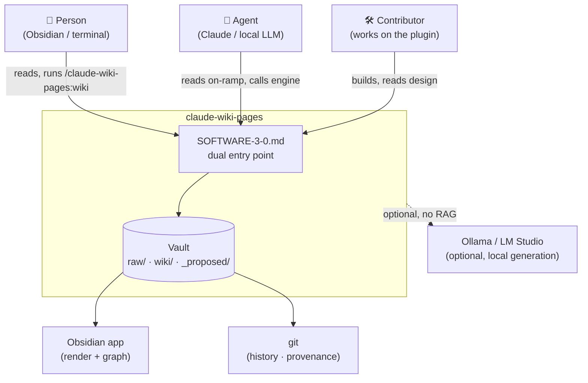
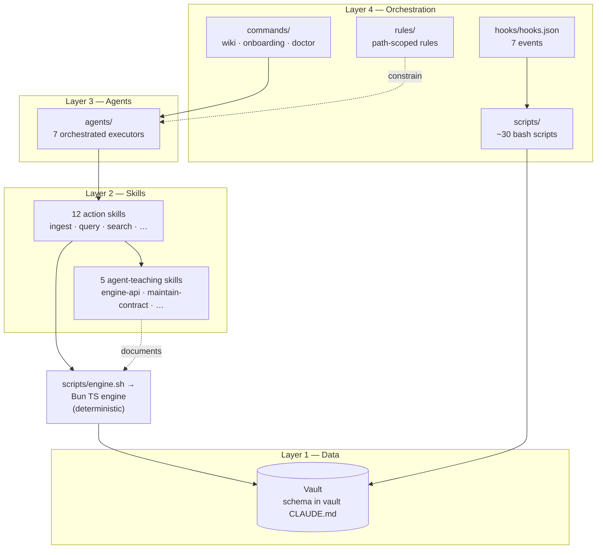

# L0–L1 — System context & layers

> Zoom out. Who uses claude-wiki-pages, what it touches, and the big moving parts.
> Authority: [`docs/architecture.md`](../architecture.md). This page visualizes it; it does not
> restate it.

## L0 — System context

The system has two co-equal first-class users — a **person** (in Obsidian or a terminal) and an
**agent** (Claude, or a local model). Both reach the same surfaces through the
[`SOFTWARE-3-0.md`](../../SOFTWARE-3-0.md) dual entry point.

**Key invariant:** the agent and the person enter the *same* system through the *same* surfaces.
There is no agent-only side door. External systems are thin — Obsidian renders, git records,
Ollama (optional) only *generates* text; none of them does retrieval (no embeddings).

## L1 — The four-layer stack

Zoom in one step: the system is four layers plus a deterministic engine and a passive vault.

**Reading guide.** Orchestration (Layer 4) dispatches; Agents (Layer 3) execute multi-step work;
Skills (Layer 2) are single-responsibility capabilities — action skills *do*, teaching skills
*explain the tool surface to agents*; Data (Layer 1) is passive and schema-governed. The **engine**
owns determinism: ranking and verification are rules, never model guesses, and never embeddings.

See [02-component-design.md](./02-component-design.md) to zoom into each layer.
