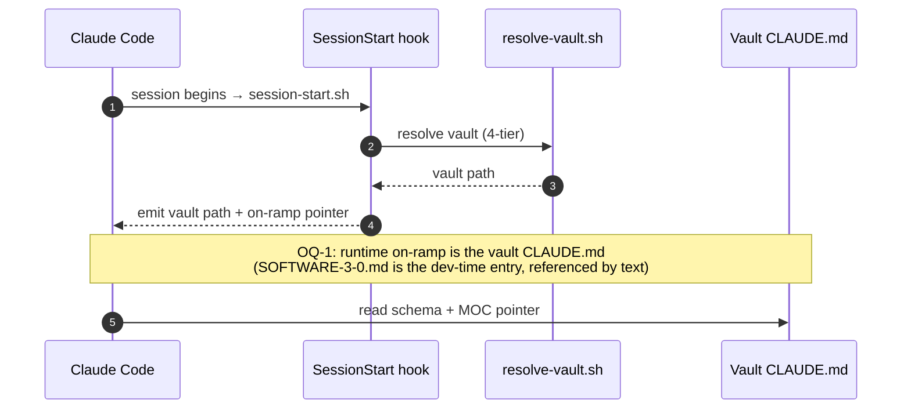
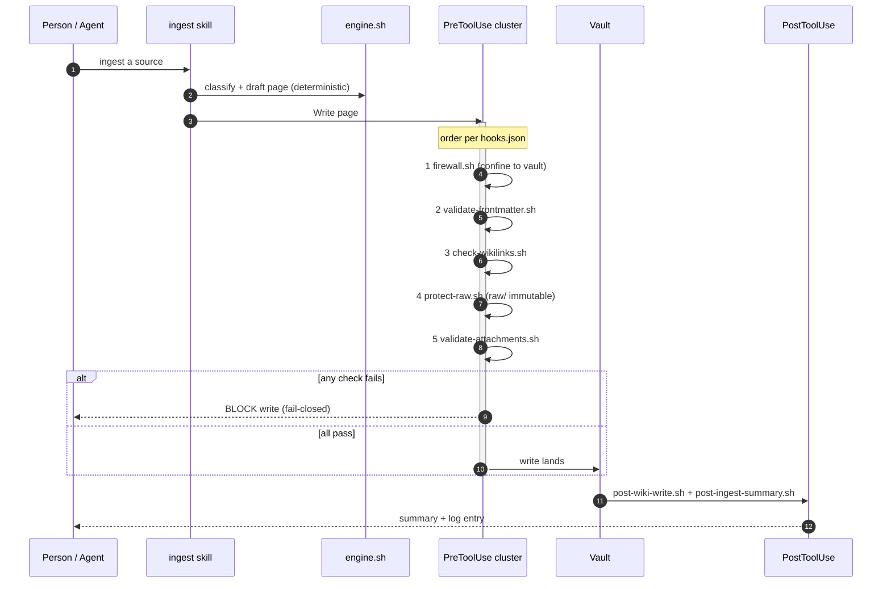
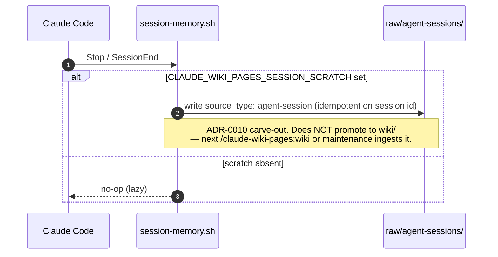

# L3 — Sequences

> Step-by-step flows. These show *when* the hooks fire and *where* the gates sit. Authority:
> [`hooks/hooks.json`](../../hooks/hooks.json), [`skills/ingest`](../../skills/ingest/SKILL.md),
> [`skills/draft`](../../skills/draft/SKILL.md), [`skills/review`](../../skills/review/SKILL.md).

## Session start — resolve the vault, orient both readers



## Ingest write-path — the hook cluster in action

A person or an agent ingests a source. Every Write/Edit passes the fail-closed `PreToolUse`
cluster *before* it lands, and `PostToolUse` summarizes after.



## Agent write-back — symmetry with a human approval gate (OQ-6)

An agent authors like a human: draft to `_proposed/`, then a **human approves** promotion. The
firewall blocks any attempt to write `wiki/` directly.

```mermaid
sequenceDiagram
    autonumber
    participant AG as Agent
    participant DR as draft skill
    participant PROP as _proposed/
    participant FW as firewall.sh
    participant WIKI as wiki/
    participant HU as Human reviewer
    participant RV as review skill

    AG->>DR: author new page
    DR->>PROP: write draft (allowed)
    AG--xFW: direct write to wiki/
    FW-->>AG: BLOCKED (must go through gate)
    HU->>RV: review _proposed/ entry
    alt approved
        RV->>WIKI: promote (git-checkpointed)
    else rejected
        RV->>PROP: leave/annotate; no promotion
    end
    Note over AG,WIKI: OQ-6 decision: human-in-the-loop is required.<br/>No agent self-approval on the default path.
```

## Durable memory — Stop / SessionEnd


