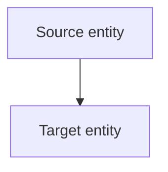

# [Zoom level] — [Diagram title]

<!-- [speculative] — placeholder nodes; fill in real repo entities before removing this marker. -->

> Zoom: [L0 Context | L1 Containers/Layers | L2 Components | L3 Sequences]
> Perspective: [component-design | sequences | teams-and-agents | config-security | feature-relations | other]
> Authority: [`docs/architecture.md`](../architecture.md). This diagram visualizes it; it does not
> restate it.

## Purpose

One sentence: what question does this diagram answer?

## Diagram

Replace the placeholder nodes below with **real repo entities** (files, skills, agents, hooks, or
scripts that exist in the tree). Layer names are Title Case per the glossary
("Layer 1 — Data", "Layer 2 — Skills", "Layer 3 — Agents", "Layer 4 — Orchestration").
When every node is grounded, **remove the `[speculative]` marker above**.

## Reading guide

Explain the key invariants this diagram enforces. Keep it to three bullets or fewer.

- Invariant one.
- Invariant two.

## See also

Link to the diagram one zoom-level up or down, or to the authority doc.
(Replace this section with real cross-links, or delete it if none apply.)
