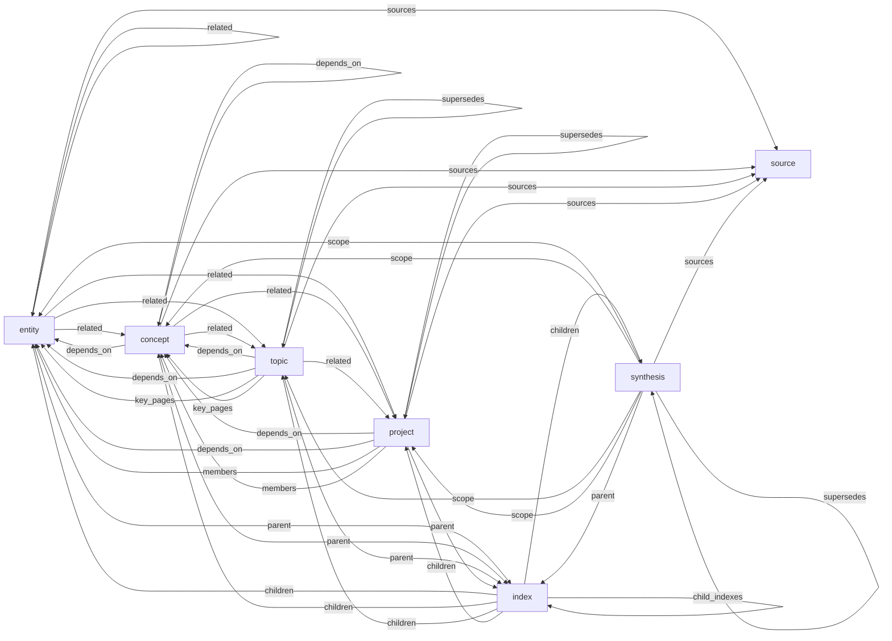

# L2 — Ontology classes and predicates

> Zoom: L2 Components
> Perspective: feature-relations
> Authority: [`skills/init/template/CLAUDE.md` — ontology-profile-v1](../../skills/init/template/CLAUDE.md#ontology-profile-ontology-profile-v1).
> This diagram visualizes the closed predicate domain→range table; it does not restate any row.

## Purpose

What page classes exist, and which typed predicates may connect them? Use this diagram to
understand the closed structural graph of the vault's formal ontology before writing wikilinks
or running the graph-traversal primitive (Brief §6).

## Diagram

## Reading guide

- Every node names a real page class from the closed `type` enum in the authority above; `manifest` and `log` are administrative classes with no predicate roles in this profile and are omitted to keep the diagram legible.
- Every edge label names a real predicate from the predicate domain→range table in the authority above; the diagram links rather than restates that table.
- The graph-traversal primitive (Brief §6) walks the provenance/association core — `sources`, `related`, `depends_on` — to N≤2; MOC/descent walks `key_pages`, `members`, `scope`, `children`, `child_indexes`, `parent`; `contradicts` and `supersedes` are available to synthesis.

## See also

- [Predicate domain→range table](../../skills/init/template/CLAUDE.md#ontology-profile-ontology-profile-v1) — the single-sourced authority; read it, do not copy its rows.
- [01-system-context.md](./01-system-context.md) — one level up: the vault as a layer in the four-layer stack.
- [06-feature-relations.md](./06-feature-relations.md) — how the engine, skills, and agents consume this ontology.
- [`docs/architecture.md`](../architecture.md) — the four-layer contract that governs every consumer of this profile.
