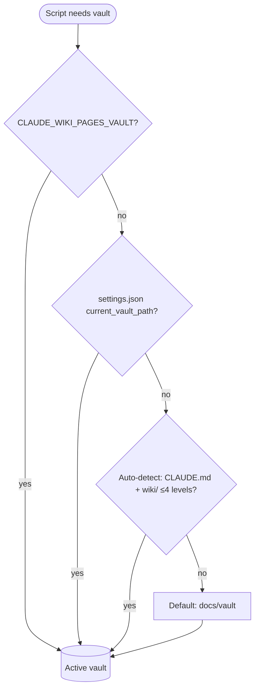

# Vault Resolution

> [!summary]
> Vault resolution is the 4-tier process by which `scripts/resolve-vault.sh` determines the active vault for every operation. First match wins. The resolver is the most load-bearing function in the plugin — it is called by every Layer 4 script before any action. Resolution is read-only: it identifies the vault but does not change it. The result flows into the [[Firewall]] as the allowed write root.

## Definition

Every Layer 4 script that reads or writes the vault begins by sourcing `scripts/resolve-vault.sh` and calling `resolve_vault()`. The function returns a single `current_vault_path` value. No script ever hard-codes a vault path.

## The Four Tiers (First Match Wins)

### Tier 1 — Environment Variable

```bash
CLAUDE_WIKI_PAGES_VAULT=/path/to/vault
```

An explicit env-var override. Used in local dev workflows and CI scripts where the vault path must be pinned precisely, independent of any config file. Setting this env var in a CI step or shell session is the cleanest way to point a script at a non-default vault without touching any config.

### Tier 2 — `settings.json` `current_vault_path`

`.claude/claude-wiki-pages/settings.json` stores the managed registry. The `current_vault_path` field is the sole authoritative source for which vault is active at any given time. It is written only by `scripts/set-vault.sh` (the `switch` command) and by `init_vault_settings` on first run. No other script writes it directly.

```json
{
  "default_vault_path": "docs/vault",
  "current_vault_path": "projects/my-vault",
  "vaults": [{ "path": "projects/my-vault", "name": "my-vault" }]
}
```

### Tier 3 — Auto-Detect

If no env-var is set and no `settings.json` is found, the resolver scans up to 4 directory levels for a file named `CLAUDE.md` that contains `schema_version:` AND is adjacent to a `wiki/` sibling directory.

This is what makes the plugin work out-of-the-box in a contributor session inside the plugin repository itself: the resolver finds `docs/vault-example/CLAUDE.md` (which declares `schema_version: 3`) automatically without any config step.

The scan depth cap (4 levels) prevents the resolver from walking the entire filesystem — a safeguard for repository trees with unusual depth.

### Tier 4 — Default

`docs/vault` — the factory default, fixed at install time and never overwritten by lifecycle commands. This is the fallback for brand-new plugin installs before any vault has been initialized.

## Switching Vaults

**Persistent switch (across sessions):**
```bash
bash scripts/set-vault.sh switch <path>
```
This writes only `current_vault_path` in `settings.json`. The `default_vault_path` is never modified by lifecycle commands — it serves as the reset reference.

**One-session override:**
```bash
CLAUDE_WIKI_PAGES_VAULT=<path> claude
```
Sets the env-var for the duration of the session. `settings.json` is not modified.

**Register a new vault without switching:**
```bash
bash scripts/set-vault.sh add <path> [name]
```
Adds the vault to the `vaults[]` array in `settings.json` and registers it with the [[Firewall]]'s `cross-vault` rule, without changing which vault is active.

## Why `resolve_vault()` Is Treated Carefully

ADR-0009 describes `resolve_vault()` as "the most load-bearing, most-tested function in the plugin" and explicitly preserves it unchanged through multi-vault additions. The reasoning: every other Layer 4 script depends on it, and any behavioral change to the resolver has blast radius across the entire hook chain. The `vaults[]` registry added by ADR-0009 is a sidecar the resolver reads but is not a new input to `resolve_vault()` — `current_vault_path` remains its sole return value.

## Connection to the Firewall

After resolution, `current_vault_path` flows immediately into the [[Firewall]] as the allowed write root. The firewall's `cross-vault` rule uses `otherVaults` (all registered vaults minus the active one) to deny writes that escape into sibling vaults. This means:

1. Resolution identifies the allowed root.
2. The firewall enforces that only that root is writable.
3. A malformed registry (where `current_vault_path` does not match any `vaults[].path`) causes the firewall to fail closed — all writes blocked.

## Mermaid Diagram



## Related

- [[Firewall]] — uses the resolved vault path as the allowed write root
- [[Multi-Vault Registry]] — Tier 2 registry that `current_vault_path` lives in
- [[Active Vault]] — `current_vault_path` designates this single entity
- [[Hook System]] — every hook script sources `resolve-vault.sh` at the start
- [[Onboarding Wizard]] — creates the initial vault and `settings.json` on first run
