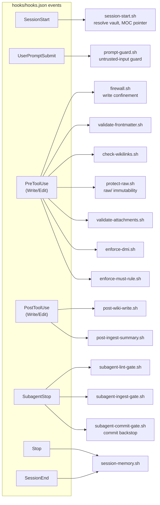
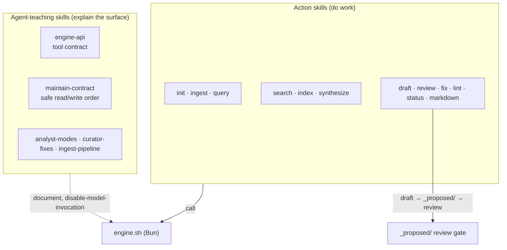
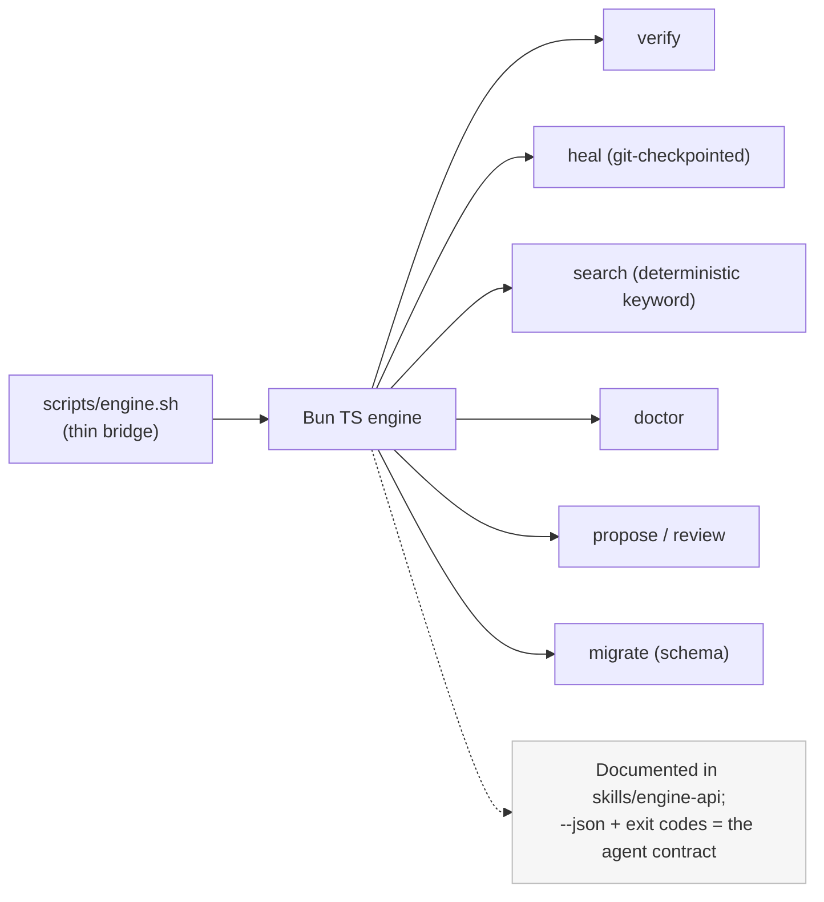
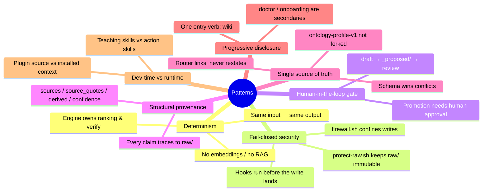

# L2 — Component design & patterns

> Zoom into the layers. Components are real files; patterns are the recurring shapes that keep
> the system coherent. Authority: [`docs/architecture.md`](../architecture.md),
> [`hooks/hooks.json`](../../hooks/hooks.json), the schema in
> [`skills/init/template/CLAUDE.md`](../../skills/init/template/CLAUDE.md).

## Orchestration components (Layer 4) — hooks → scripts

Every hook event fans out to deterministic bash scripts. This is the enforcement spine: nothing
reaches the vault un-checked.

**Note the fail-closed cluster on `PreToolUse`:** `firewall.sh` (confine writes to the resolved
vault) and `protect-raw.sh` (block edits to `raw/`) run *before* any Write/Edit lands. That is the
security boundary — see [05-claude-config-security.md](./05-claude-config-security.md).

## Skill components (Layer 2) — action vs teaching

Action skills change state through the engine and the `_proposed/` gate; **teaching skills carry
`disable-model-invocation: true`** — they are reference material an agent reads, not actions it
fires. This is how an agent learns the tool surface without inlining it.

## Engine commands (the agent's tool surface)

> `[speculative]` on exact verb inventory: `engine.sh` is a thin bridge to a Bun TS CLI; some
> verbs are documented in [`skills/engine-api`](../../skills/engine-api/SKILL.md) ahead of the
> shipped shell. The plan's Phase 3 closes this engine-shell-vs-TS gap.

## Patterns this codebase uses

Each pattern maps to enforcement: determinism → the engine; fail-closed → the `PreToolUse`
cluster; human-in-the-loop → the `_proposed/` gate; provenance → the schema + `validate-frontmatter.sh`;
single-source → `validate-docs.sh`. Patterns here are *checked*, not just aspired to.
