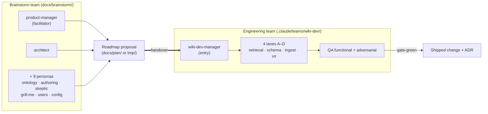
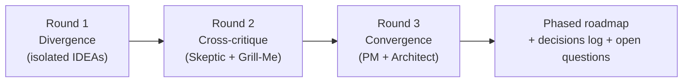
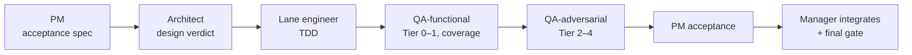
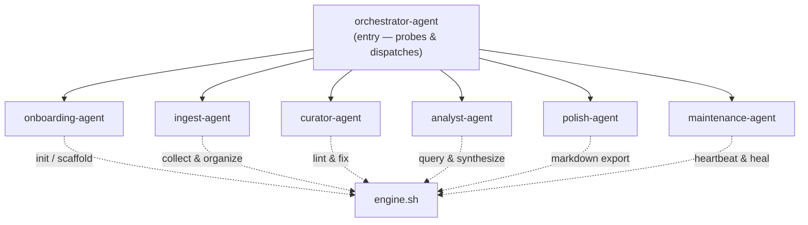

# Teams & agents

> How the **dev teams** (build the plugin) and the **runtime agents** (run inside the installed
> plugin) work. Authority: [`docs/teams.md`](../teams.md), [`agents/`](../../agents/),
> [`docs/brainstorm/`](../brainstorm/README.md), [`.claude/teams/wiki-dev/`].

## Two dev teams — ideate, then build

The brainstorm team is **read-only / proposal-only**; the engineering team **implements** behind
the test gates. The handoff artifact is a roadmap — see this very effort:
[`tmp/SOFTWARE-3-0-plan.md`](../../tmp/SOFTWARE-3-0-plan.md).

## Brainstorm protocol — three rounds

## Engineering handoff chain — every item

## Runtime agents — 7 orchestrated executors

These ship in the plugin and run inside a user's session. The **orchestrator** is the entry that
probes vault state and dispatches.

| Agent | Drives skills | Job |
| --- | --- | --- |
| orchestrator | (dispatch) | Probe vault, route to the right agent |
| onboarding | init, onboarding | First-run scaffold + orient |
| ingest | ingest, draft, review | Sources → typed wiki pages |
| curator | lint, fix | Keep the vault well-formed |
| analyst | query, search, synthesize | Answer + cross-topic synthesis |
| polish | markdown, index | Export + MOC upkeep |
| maintenance | status, heartbeat | Staleness, self-heal, backlog |

**Dev teams vs runtime agents are different populations:** `wiki-dev-*` and the brainstorm
personas live in `.claude/` and `docs/` and never ship; the 7 `claude-wiki-pages-*-agent` files in
`agents/` are runtime context loaded on install (per [`CLAUDE.md`](../../CLAUDE.md)).
