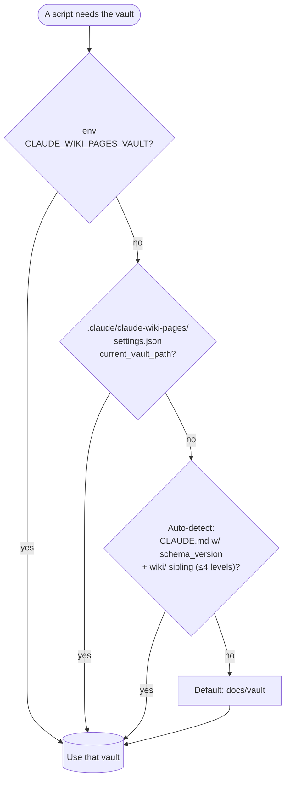
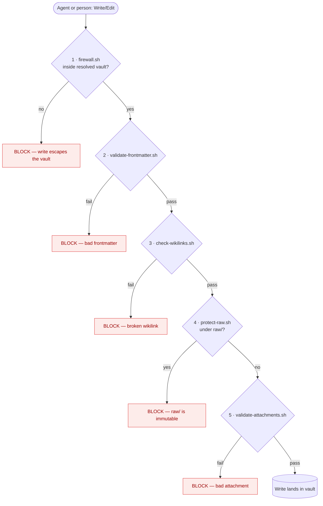
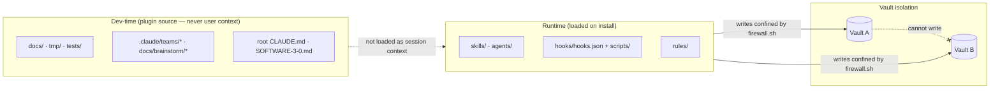
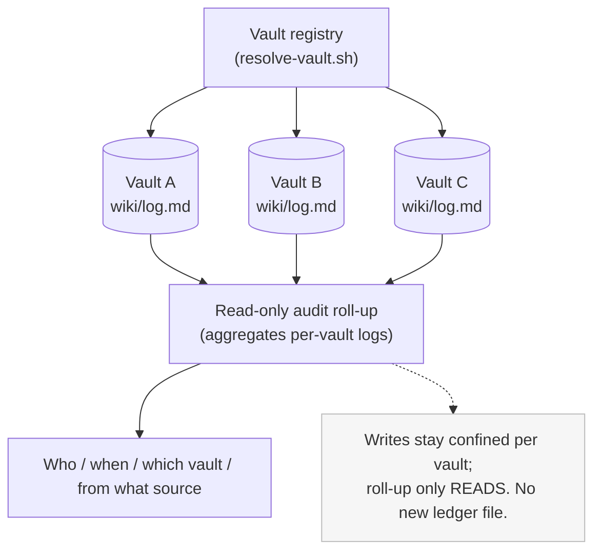

# Configuration · security · isolation

> How the plugin's configuration is set up, how writes are secured, and how vaults are isolated.
> Authority: [`scripts/resolve-vault.sh`](../../scripts/resolve-vault.sh),
> [`scripts/firewall.sh`](../../scripts/firewall.sh), [`hooks/hooks.json`](../../hooks/hooks.json),
> [`docs/security.md`](../security.md), [`docs/operations.md`](../operations.md).

## Setup — vault resolution (4-tier, first match wins)

Switching vaults is `bash scripts/set-vault.sh <path>` (writes only `current_vault_path`). This is
the **single config source** for which vault is active — the router links it, never copies it.

## Security — the fail-closed write boundary

Every Write/Edit runs the full `PreToolUse` chain *before* it lands, **in the exact order wired in
[`hooks/hooks.json`](../../hooks/hooks.json)**: firewall (confinement) first, then the validators,
with `raw/` immutability enforced inside the same pre-write chain.

Fail-closed means **a check that errors blocks the write** — the safe default is "no write", not
"write anyway". The `UserPromptSubmit` hook (`prompt-guard.sh`) applies the same posture to
untrusted input *before* it becomes instructions.

## Isolation — dev-time vs runtime, and per-vault confinement

**Two isolation axes.** (1) *Dev-time vs runtime* — the plugin source (`docs/`, `tmp/`, the dev
teams) is never loaded as a user's session context; only `skills/`, `agents/`, hooks+scripts, and
`rules/` are. (2) *Per-vault* — `firewall.sh` confines every write to the resolved vault, so a
session targeting Vault A cannot write Vault B.

## Multi-vault management & audit roll-up (OQ-8 — in scope)

Per the decision to bring simultaneous multi-vault management in scope, the design **reuses existing
provenance surfaces** for audit — it does *not* add a parallel ledger (Skeptic veto V3). Each vault
keeps its own `wiki/log.md` and ADR-0010 `agent-session` sources; a read-only roll-up aggregates
across the registry under the same firewall confinement.

> Engineering note: **cross-vault write confinement already exists** —
> [ADR-0009](../adr/ADR-0009-multi-vault-confinement.md) specifies the deny rule and precedence, and
> [`tests/gates/gate-11-firewall-parity.sh`](../../tests/gates/gate-11-firewall-parity.sh) pins it.
> What is *new* (Phase M) is simultaneous **management** of N vaults. Reuse the existing confinement;
> the firewall keeps deriving "other vaults" from the registry (it never re-stores them), and a
> malformed registry must resolve **fail-closed** (zero writable roots), not to all. Tracked in
> [`tmp/SOFTWARE-3-0-plan.md`](../../tmp/SOFTWARE-3-0-plan.md).
