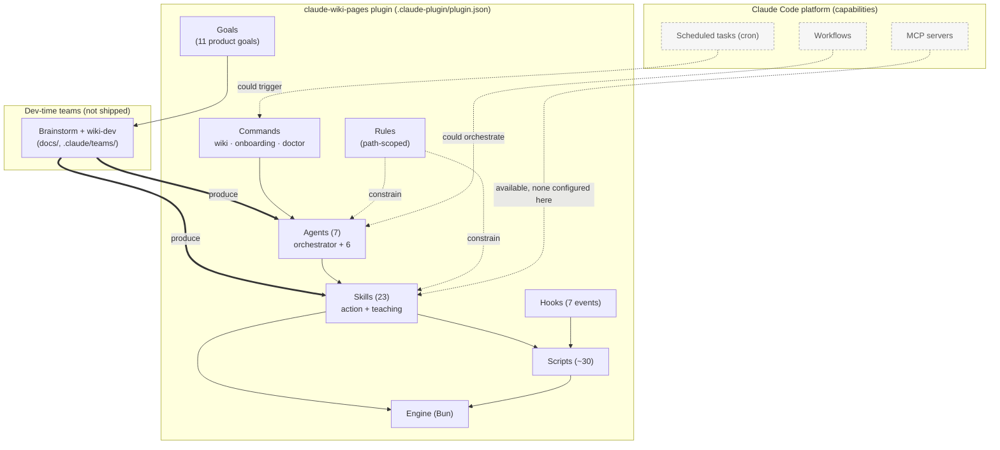

# Claude Code feature relations

> How the Claude Code building blocks connect *in this repo* — commands, agents, teams, hooks,
> rules, skills, scripts, the plugin package, MCP, scheduled tasks, workflows, and goals.
> Distinguishes what this plugin **defines** from what the Claude Code **platform** offers.
> Authority: [`CLAUDE.md`](../../CLAUDE.md), [`.claude-plugin/plugin.json`](../../.claude-plugin/plugin.json),
> [`hooks/hooks.json`](../../hooks/hooks.json), [`docs/teams.md`](../teams.md).

## The map

Solid edges are wired in this repo; **dashed nodes/edges are platform capabilities not (yet)
configured here** — they show how the plugin *could* extend.

## What's defined here vs available

| Feature | In this repo? | Where / note |
| --- | --- | --- |
| **Plugin** | ✅ defined | [`.claude-plugin/plugin.json`](../../.claude-plugin/plugin.json) — the package manifest |
| **Commands** | ✅ 3 | [`commands/`](../../commands/) — `wiki` (entry), `onboarding`, `doctor` |
| **Agents** | ✅ 7 | [`agents/`](../../agents/) — orchestrator + onboarding/ingest/curator/analyst/polish/maintenance |
| **Skills** | ✅ 23 | [`skills/`](../../skills/) — 12 action + 5 teaching + obsidian refs |
| **Hooks** | ✅ 7 events | [`hooks/hooks.json`](../../hooks/hooks.json) — Session/Prompt/PreTool/PostTool/SubagentStop/Stop/SessionEnd |
| **Scripts** | ✅ ~30 | [`scripts/`](../../scripts/) — enforcement + the engine bridge |
| **Rules** | ✅ | [`rules/`](../../rules/) — path-scoped constraints |
| **Teams** | ✅ dev-time | [`docs/teams.md`](../teams.md) — brainstorm + `wiki-dev` (never shipped) |
| **Goals** | ✅ | The 11 product goals (TEAM-BRIEF §2) drive the teams |
| **MCP** | ⚪ available | none configured; an MCP server could back a skill |
| **Scheduled tasks** | ⚪ available | the maintenance loop is opt-in today; cron could trigger `/claude-wiki-pages:wiki` |
| **Workflows** | ⚪ available | multi-agent orchestration is manual today; a workflow could drive the agents |

## Connection rules (how to read the graph)

- **Goals → teams → agents/skills:** product goals are realized by the dev teams, which author the
  shipped agents and skills. Goals never call code directly.
- **Commands → agents → skills → engine/scripts:** the user-facing call chain. One entry verb
  (`/claude-wiki-pages:wiki`) fans into agents, which drive single-responsibility skills, which call
  the deterministic engine and scripts.
- **Hooks → scripts:** orthogonal enforcement. Hooks fire on lifecycle events and run scripts that
  *gate* the call chain (security, validation, provenance) — see
  [05-claude-config-security.md](./05-claude-config-security.md).
- **Rules constrain, they don't execute:** path-scoped rules shape what agents and skill edits may
  do; some are enforced by hooks (`enforce-must-rule.sh`, `enforce-dmi.sh`).
- **Platform features are extension points:** MCP, scheduled tasks, and workflows are available and
  would plug into the same call chain without a new surface — the KISS path for future automation.
